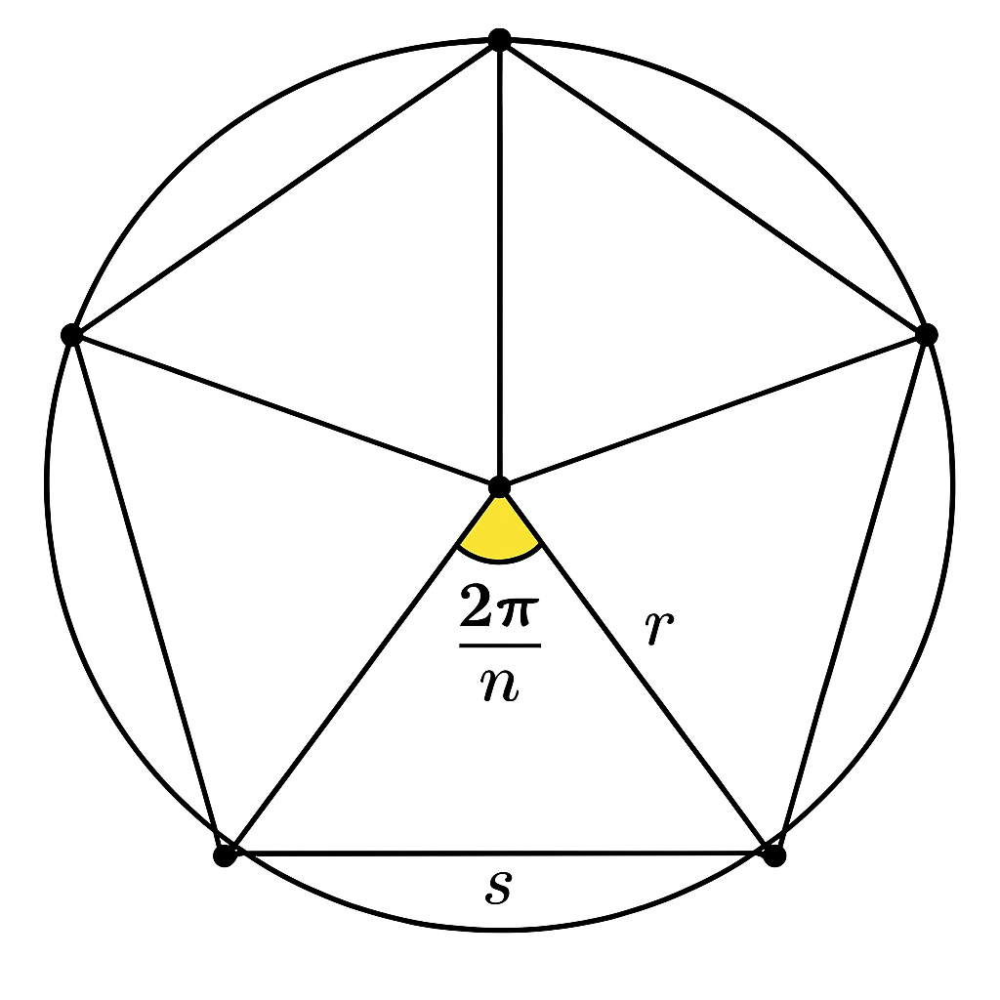

# Introdução à Programação Orientada a Objetos (OOP)

## Por que OOP? 
- Software moderno é **complexo** → precisamos de organização.
- OOP ajuda a:
    - Gerir a complexidade com **abstração**
    - Reutilizar código com **herança**
    - Escrever programas mais **flexíveis e extensíveis**

---

## Objetos e Classes
- **Objeto**: entidade com estado + comportamento.
- **Classe**: molde usado para criar objetos.

### Exemplo
```java
public class Point {
    private int x;
    private int y;

    public Point(int x, int y) {
        this.x = x;
        this.y = y;
    }

    public void translate(int dx, int dy) {
        this.x += dx;
        this.y += dy;
    }

    public String toString() {
        return "(" + x + ", " + y + ")";
    }

    public static void main(String[] args) {
        Point p = new Point(3, 4);
        p.translate(1, 2);
        System.out.println(p);   // (4, 6)
    }
}
```

---

## Encapsulamento
- Protege os dados internos.
- Usamos `private` para ocultar e `public` para expor apenas o necessário.

---

## Herança
- Reutilizar e estender comportamentos.

```java
public class Employee {
    private String name;
    private double salary;

    public double getSalary() { return salary; }
}

public class Lawyer extends Employee {
    private int workedHours;
    private double hourlyRate;
    public void setWorked(int hours, double rate) { 
        workedHours = hours; 
        hourlyRate = rate;
    }
    @Override
    public double getSalary() {
        return super.getSalary() + workedHours*hourlyRate;
    }
}
```

---


# Polimorfismo com Formas Geométricas (Java)

> **Objetivo:** praticar 
> - ‘interfaces’, 
> - classes concretas, 
> - listas polimórficas e 
> - operações genéricas sobre coleções de objetos.

---

## Interface base

```java
public interface Shape {
    double area();
    double perimeter();
    String name(); // para impressão
}
```

---

## Tarefas (antes de ver as soluções)

1. **Implemente** as classes abaixo, todas `implements Shape`:
    - `Circle(double r)` — raio `r`.
    - `Rectangle(double w, double h)` — largura `w`, altura `h`.
    - `RightTriangle(double a, double b)` — catetos `a` e `b`.
    - `RegularPolygon(int n, double s)` — n lados, lado `s`.
2. **Crie** uma lista polimórfica `List<Shape>` com exemplos variados.
3. **Imprima** (uma por linha) `name()`, área e perímetro de cada forma.
4. **Calcule** a **área total** e o **perímetro total** da lista.
5. **Filtre** apenas as formas com área > X (ex.: 50) usando `stream()`.
6. **Ordene** a lista **por área crescente**.
7. **(Opcional)**: crie `CompositeShape` que recebe uma lista de `Shape` e cuja `area()`/`perimeter()` são as somas das internas.
8. **(Opcional)**: crie uma função utilitária genérica:
  
   ```java
   static double sumAreas(Collection<? extends Shape> shapes);
   ```
 
   que soma as áreas de qualquer coleção de `Shape` ou subtipos.

> Tente fazer tudo acima **sem olhar as soluções**. Quando terminar, compare.

---

## Soluções

### 1 Implementações das formas

```java
public class Circle implements Shape {
    private final double r;
    public Circle(double r) { this.r = r; }
    public double area() { return Math.PI * r * r; }
    public double perimeter() { return 2 * Math.PI * r; }
    public String name() { return "Circle(r=" + r + ")"; }
}
```

```java
public class Rectangle implements Shape {
    private final double w, h;
    public Rectangle(double w, double h) { this.w = w; this.h = h; }
    public double area() { return w * h; }
    public double perimeter() { return 2 * (w + h); }
    public String name() { return "Rectangle(" + w + "x" + h + ")"; }
}
```

```java
public class RightTriangle implements Shape {
    private final double a, b; // catetos
    public RightTriangle(double a, double b) { this.a = a; this.b = b; }
    public double area() { return (a * b) / 2.0; }
    public double perimeter() { return a + b + Math.hypot(a, b); }
    public String name() { return "RightTriangle(a=" + a + ", b=" + b + ")"; }
}
```

```java
public class RegularPolygon implements Shape {
    private final int n;      // número de lados
    private final double s;   // tamanho do lado
    public RegularPolygon(int n, double s) {
        if (n < 3) throw new IllegalArgumentException("n >= 3");
        this.n = n; this.s = s;
    }
    public double perimeter() { return n * s; }
    public double area() {
        // Fórmula: A = (n * s^2) / (4 * tan(pi/n))
        return (n * s * s) / (4.0 * Math.tan(Math.PI / n));
    }
    public String name() { return "RegularPolygon(n=" + n + ", s=" + s + ")"; }
}
```

### 2 Lista polimórfica, impressão, totais, filtro e ordenação

```java
import java.util.*;
import java.util.stream.Collectors;

public class ShapesDemo {
    public static void main(String[] args) {
        List<Shape> shapes = new ArrayList<>(List.of(
            new Circle(5),
            new Rectangle(4, 8),
            new RightTriangle(3, 4),
            new RegularPolygon(6, 3),   // hexágono regular
            new Circle(2.5),
            new Rectangle(10, 2)
        ));

        // 1) imprimir cada forma
        shapes.forEach(s ->
            System.out.printf("%-28s  area=%8.3f  perim=%8.3f%n", s.name(), s.area(), s.perimeter())
        );

        // 2) totais
        double totalArea = shapes.stream().mapToDouble(Shape::area).sum();
        double totalPer = shapes.stream().mapToDouble(Shape::perimeter).sum();
        System.out.printf("%nTOTAL area=%.3f  perimeter=%.3f%n%n", totalArea, totalPer);

        // 3) filtrar por área > 50
        List<Shape> big = shapes.stream()
            .filter(s -> s.area() > 50.0)
            .collect(Collectors.toList());
        System.out.println("Formas com area > 50: " + big.size());

        // 4) ordenar por área crescente
        shapes.sort(Comparator.comparingDouble(Shape::area));
        System.out.println("\nOrdenadas por area:");
        shapes.forEach(s ->
            System.out.printf("%-28s  area=%8.3f%n", s.name(), s.area())
        );
    }
}
```

### 3 (Opcional) Forma composta + utilitário genérico

```java
package course01;

import java.util.List;
import java.util.Collection;

public class CompositeShape implements Shape {

    private final List<Shape> parts;

    public CompositeShape(List<Shape> parts) {
        // Copy for immutability
        this.parts = List.copyOf(parts);
    }

    // Compute total area of all parts
    @Override
    public double area() {
        return parts.stream()
                .mapToDouble(Shape::area)
                .sum();
    }

    // Compute total perimeter
    @Override
    public double perimeter() {
        return parts.stream()
                .mapToDouble(Shape::perimeter)
                .sum();
    }

    @Override
    public String name() {
        return "CompositeShape(" + parts.size() + " parts)";
    }

    // --- Static utility methods ---
    public static double totalArea(Collection< Shape> shapes) {
        return shapes.stream()
                .mapToDouble(Shape::area)
                .sum();
    }

    public static double totalPerimeter(Collection< Shape> shapes) {
        return shapes.stream()
                .mapToDouble(Shape::perimeter)
                .sum();
    }

    // --- Example of usage ---
    public static void main(String[] args) {
        Shape circle = new Circle(2.0);
        Shape rect = new Rectangle(3.0, 4.0);
        Shape tri = new RightTriangle(3.0, 4.0);

        // Combine shapes into one composite
        CompositeShape composite = new CompositeShape(List.of(circle, rect, tri));

        System.out.println(composite.name());
        System.out.println("Area = " + composite.area());
        System.out.println("Perimeter = " + composite.perimeter());

        // Use static utilities directly
        double allAreas = CompositeShape.totalArea(List.of(circle, rect, tri));
        System.out.println("Sum of areas (via static util): " + allAreas);
    }
}
```

---

## Discussão didática (para aula)
- **Polimorfismo**: uma mesma referência `Shape` aponta para objetos de tipos distintos (`Circle`, `Rectangle`, …) e invoca o método correto em tempo de execução.
- **Encapsulamento**: campos privados, API pública minimal.
- **Coesão**: cada classe conhece apenas o suficiente para calcular suas medidas.
- **Aberto/Fechado**: adicionar uma nova forma **não** quebra o código que opera sobre `Shape`.
- **Streams**: mostram operações agregadas elegantes (somar áreas, filtrar, ordenar).
