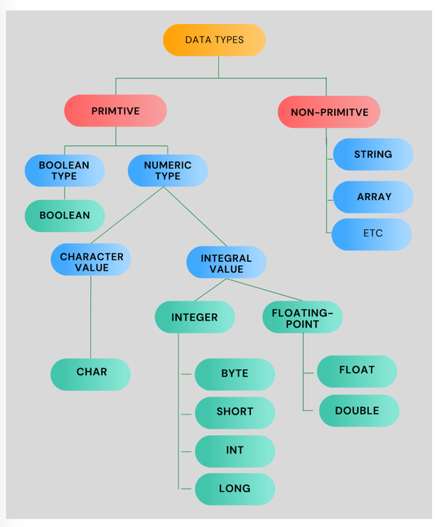

# Java Basics – Data Types and Strings

## Learning goals
- Understand Java’s **primitive** and **reference** types.
- Learn how data is **stored** and **represented**.
- Practice **String manipulation** and **character access**.
- Write small programs to reinforce these concepts.

---

## Primitive Data Types

Java provides **8 primitive types** that define the most basic kinds of data.

| Type | Size | Example | Notes |
|------|------|----------|-------|
| `boolean` | 1 bit | `true`, `false` | Logical values |
| `byte` | 8 bits | `byte a = 100;` | Small integers, useful for memory saving |
| `short` | 16 bits | `short s = 20000;` | Larger range than byte |
| `int` | 32 bits | `int n = 1234;` | Default integer type |
| `long` | 64 bits | `long n = 123456L;` | Bigger integer range |
| `float` | 32 bits | `float f = 3.14f;` | Floating-point (less precise) |
| `double` | 64 bits | `double d = 3.141592;` | Default for decimals |
| `char` | 16 bits | `char c = 'A';` | Unicode character |

> 💡 Tip: `int` and `double` are the **defaults** for numeric operations in Java.

---

### How they differ in memory

Think of memory as small labeled boxes:

From https://logicmojo.com/data-types-in-java


---

### 🔢 Example

```java
public class DataTypesDemo {
    public static void main(String[] args) {
        byte age = 20;
        double height = 1.75;
        char initial = 'A';
        boolean isStudent = true;

        System.out.println("Age: " + age);
        System.out.println("Height: " + height);
        System.out.println("Initial: " + initial);
        System.out.println("Is student? " + isStudent);
    }
}
```

---

### 🧠 Quick Exercises

1. Declare and print variables of each primitive type.  
2. Try to assign `int` to `byte` — what happens?  
3. Print the **minimum** and **maximum** of `Integer` using:
   ```
   System.out.println(Integer.MIN_VALUE);
   System.out.println(Integer.MAX_VALUE);
   ```
4. Why can’t `float` and `double` store **exact** money values?

---

## 🧭 2. Reference (Object) Data Types

Reference types store **addresses of objects** rather than raw values.

Example:
```java
String name = "Maria";
int[] scores = {10, 20, 30};
```

`name` and `scores` point to **objects** in memory.

Default value for a reference: `null`

👉 [Reference vs Primitive Types in Java (GeeksforGeeks)](https://www.geeksforgeeks.org/difference-between-primitive-and-non-primitive-data-types-in-java/)

---

## 📝 3. Java Literals and Escape Sequences

### Numeric literals
```java
int dec = 100;
int oct = 0144;   // octal
int hex = 0x6a;   // hexadecimal
```

### Character and String literals
```java
char c = '\u0041';  // 'A'
String text = "Hello\nWorld!";
```

**Common escape sequences:**
| Sequence | Meaning |
|-----------|----------|
| `\n` | New line |
| `\t` | Tab |
| `\"` | Double quote |
| `\\` | Backslash |

---

## Strings in Java

Strings are **objects**, not primitive types.  
They represent sequences of characters, e.g. `"Olá Mundo"`.

### Concatenation
```
String a = "32";
int b = 32;
System.out.println(a + b);  // "3232"
```
The `+` operator means **concatenation** if any operand is a String.

---

### 🔍 Useful String methods

| Method | Description | Example | Output |
|---------|-------------|----------|---------|
| `charAt(i)` | Character at position `i` | `"tigre".charAt(1)` | `'i'` |
| `length()` | String length | `"papagaio".length()` | `8` |
| `indexOf('a')` | Index of character | `"papagaio".indexOf('a')` | `1` |
| `toUpperCase()` | Converts to uppercase | `"gato".toUpperCase()` | `"GATO"` |
| `substring(a,b)` | Extracts part of string | `"CoffeeOrTea".substring(8)` | `"Tea"` |
| `split(",")` | Splits by delimiter | `"A,B,C".split(",")` | `[A, B, C]` |
| `trim()` | Removes extra spaces | `"  hi  ".trim()` | `"hi"` |

---

### Immutability

Strings **cannot change** once created.
```
String animal = "papagaio";
animal.toUpperCase();
System.out.println(animal); // still "papagaio"
```

`toUpperCase()` returns a **new String**.

---

### ⚖️ String comparison

```
String a = "cat";
String b = new String("cat");
System.out.println(a == b);         // false
System.out.println(a.equals(b));    // true
```

> `==` compares **references**, `equals()` compares **contents**.

---

### 🔁 Traversing Strings

```
String word = "JAVA";
for (int i = 0; i < word.length(); i++) {
    System.out.println(word.charAt(i));
}
```

Alternative (enhanced for):
```
for (char c : word.toCharArray()) {
    System.out.println(c);
}
```

---

### Practice Tasks

1. Write a method that:
   - Removes spaces at both ends,
   - Extracts a substring from index `start` to `end`,
   - Converts to uppercase.

Example:
```java
public static String sc(String text, int start, int stop) {
    return text.trim().substring(start, stop).toUpperCase();
}
```

Test:
```
System.out.println(sc("  hello world  ", 0, 5)); // HELLO
```

2. Ask the user for their first and last name and print:
   ```
   Welcome, FIRSTNAME LASTNAME!
   ```

3. Count how many vowels appear in a given word.

---

## Summary
- **Primitive types** store simple values.
- **Reference types** store memory addresses (objects).
- **Strings** are immutable sequences of characters.
- Use **`.equals()`** for comparison.
- Methods like `substring`, `split`, `trim` are key for text handling.

---

## Further Reading
- [Java Data Types – Oracle Docs](https://docs.oracle.com/javase/tutorial/java/nutsandbolts/datatypes.html)
- [Java String Class – Oracle Docs](https://docs.oracle.com/javase/8/docs/api/java/lang/String.html)
- [Programiz Java Tutorial](https://www.programiz.com/java-programming)
- [W3Schools – Java Strings](https://www.w3schools.com/java/java_strings.asp)

---

## 🧪 Mini Quiz (Optional)
1. What is the default value of an uninitialized `boolean` variable?  
2. What is the output of `"abc".substring(1,3)`?  
3. How many bytes does a `char` use?  
4. Why is `float f = 2.3;` invalid?

---

*Prepared for Object-Oriented Programming – UAL 2025*
